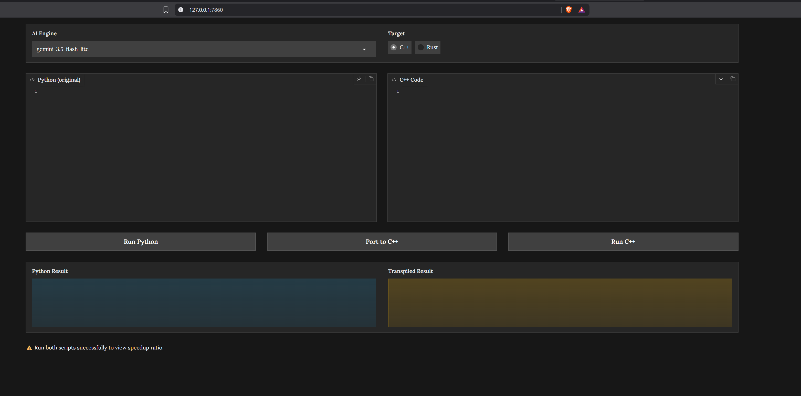
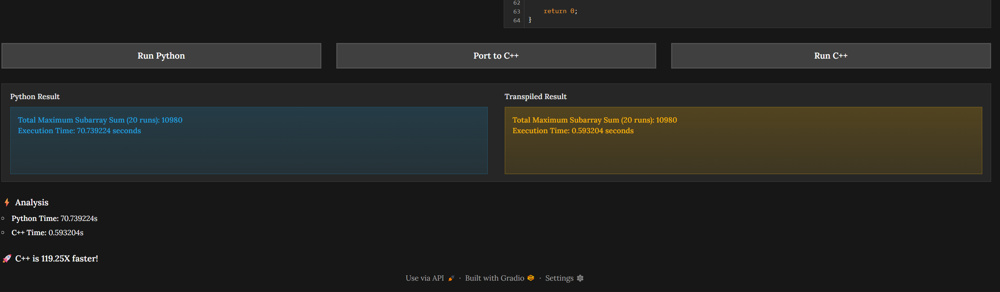
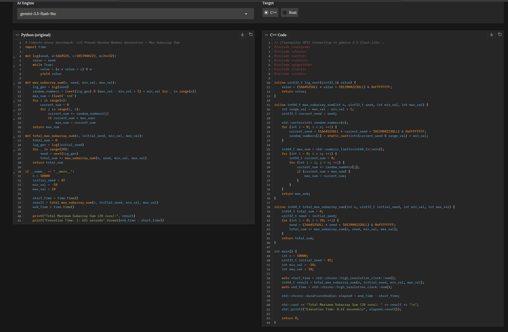
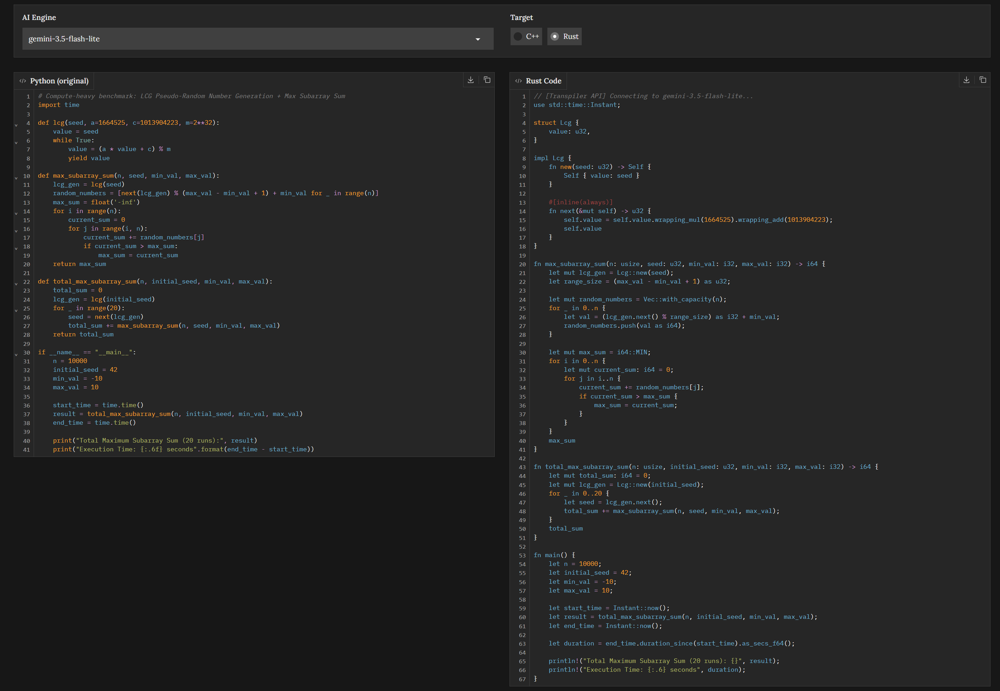
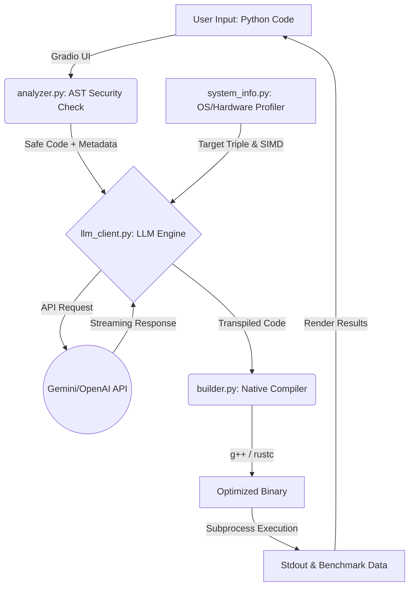

# 🚀 LLM-Powered Python-to-Native Transpiler

**Instantly port, compile, and benchmark compute-heavy Python scripts in highly optimized C++ or Rust using AI.**
**Accelerate compute-bound Python into highly optimized C++ or Rust via LLM-powered, hardware-aware transpilation and automated benchmarking.**




---
```markdown
## 📖 Table of Contents
* [⚡ Overview](#-overview)
* [✨ Key Features](#-key-features)
* [📊 Performance Benchmarks](#-performance-benchmarks)
* [🏗️ Repository Structure](#️-repository-structure)
* [🏗️ Architecture Diagram](#️-architecture-diagram)
* [⚙️ How It Works (Under the Hood)](#️-how-it-works-under-the-hood)
* [🚀 Getting Started](#-getting-started)
  * [Prerequisites](#prerequisites)
  * [Installation](#installation)
  * [Usage](#usage)
* [📝 License](#-license)
```
---

## ⚡ Overview

The **LLM Transpiler** is an interactive web environment that takes standard Python code, securely analyzes its syntax, and uses Large Language Models to transpile it into heavily optimized **C++** or **Rust**. 

Unlike standard code generators, this tool is aware of your local hardware. It injects your system architecture, CPU brand, and available SIMD instructions directly into the LLM's context window, ensuring the generated native code is tailored for maximum performance on your specific machine. It then compiles the code on the fly and benchmarks the runtime against the original Python script.

## ✨ Key Features

*   **Real-Time LLM Streaming:** Watch the transpiled code generate token-by-token in the UI.
*   **Intelligent Fallback Engine:** Features a 3-model fallback queue. If the primary LLM hits a rate limit or times out, the stream automatically switches to a backup model without crashing the UI. <br>*(See: ``)*
*   **AST Security Layer:** Before any code is sent to the LLM or executed locally, the Python Abstract Syntax Tree (AST) is traversed to block malicious OS-level commands (e.g., `os.system`, `eval`).
*   **Hardware-Aware Prompting:** Automatically queries OS, CPU, and toolchain data to construct highly specific prompts, ensuring the LLM utilizes the best native compiler flags (`-Ofast`, `-march=native`, `opt-level=3`).
*   **1-Click Benchmarking:** Execute both the Python and native scripts in isolated subprocesses, capture the output, and calculate the exact performance speedup multiplier.

---

## 📊 Performance Benchmarks

When testing compute-heavy workloads (like the 1-Billion loop iteration Linear Congruential Generator + Max Subarray Sum provided in `benchmarks.py`), native compilation yields massive speedups.

| Python vs C++ Runtime | Python vs Rust Runtime |
| :---: | :---: |
|  |  |
|  |  |

---

## 🏗️ Repository Structure

```text
llm_transpiler/
├── requirements.txt            # Python dependencies
├── app.py                      # Main Gradio application entry point
├── styles.py                   # Extracted CSS and UI styling
├── benchmarks.py               # Sample compute-heavy Python scripts for testing
├── main.cpp                    # Dynamically generated C++ execution file
├── main.rs                     # Dynamically generated Rust execution file
├── assets/                     # Documentation images and UI screenshots
│   ├── corresponding_cpp_code.png
│   ├── corresponding_rust_code.png
│   ├── python_vs_cpp_runtime.png
│   ├── python_vs_rust_runtime.png
│   ├── ui.png
│   └── llm_fallback.png
└── transpiler/
    ├── __init__.py
    ├── analyzer.py             # AST parsing and syntax security checks
    ├── builder.py              # Subprocess execution and compilation pipelines
    ├── system_info.py          # Hardware, OS, and toolchain detection
    └── llm_client.py           # LLM API setup, model fallbacks, and prompt engineering
```
---
## 🏗️ Architecture Diagram


---

## ⚙️ How It Works (Under the Hood)

* **Code Input & AST Analysis (`analyzer.py`):** The user inputs Python code. The AST visitor checks for banned methods (like file deletion or shell execution) and extracts all module imports and function names.
* **System Profiling (`system_info.py`):** The backend detects your OS target triple, CPU model, core count, and available SIMD flags (e.g., AVX2, NEON).
* **Prompt Injection (`llm_client.py`):** The AST metadata and hardware profile are combined with the target language's strictest compiler flags and sent to the LLM.
* **Compilation & Execution (`builder.py`):** The streamed response is written to `main.cpp` or `main.rs`. Subprocesses trigger `g++` or `rustc` with heavy optimization flags, run the binary, capture stdout via an I/O buffer, and handle infinite loop timeouts gracefully.

---

## 🚀 Getting Started

### Prerequisites
To use the full compilation pipeline, ensure you have the following installed on your system:

* **Python 3.8+**
* **C++ Toolchain:** `g++` (GCC) or `clang` accessible via terminal.
* **Rust Toolchain:** `rustc` and `cargo` (via `rustup`) accessible via terminal.

### Installation

**1. Clone the repository:**
```bash
git clone https://github.com/Subhrajyoti8520/llm-transpiler.git
cd llm-transpiler
```
**2. Install Python dependencies:**
```bash
pip install -r requirements.txt
```
**3. Configure the environment:**
Create a `.env` file in the root directory and add your LLM provider credentials. By default, the client is configured to accept Gemini/OpenAI standard base URLs.
```env
API_KEY=your_api_key_here
BASE_URL=https://generativelanguage.googleapis.com/v1beta/openai/
```
### Usage

Start the Gradio web interface by running:
```bash
python app.py
```
- Open your browser to the local address provided (usually http://127.0.0.1:7860).
- Paste the contents of benchmarks.py into the Python editor.
- Select your target language and AI model, then click Port to...
- Run both the Python and Target scripts to view the execution time multiplier!
  
---
## 📝 License
This project is MIT licensed.
